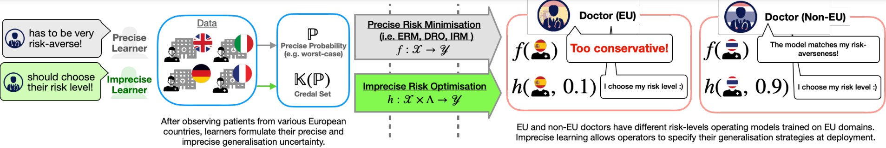
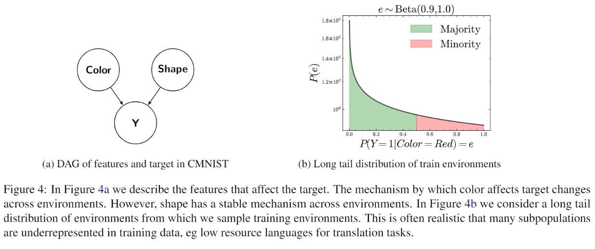
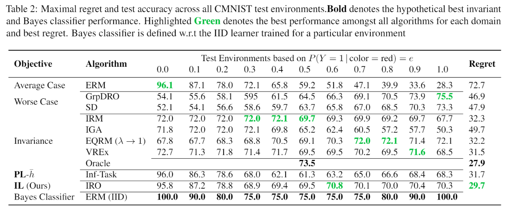

# Domain Generalisation via Imprecise Learning

This repository contains the code base for the paper "Domain Generalization by Imprecsie Learning" accepted at ICML 2024. 
## Table of Contents
- [Overview](#overview)
- [Installation](#installation)
- [Usage](#usage)
- [Datasets](#datasets)
- [Results](#results)
- [Contributing](#contributing)
- [Contact](#contact)

## Overview

The paper presents a novel approach to domain generalization by contending that that domaingeneralisation encompasses both statistical learning and decision-making. Learners are thus compelled to make normative judgments, leading to misalignment amidst institutional separation from model operators. Leveraging imprecise probability, our proposal, Imprecise Domain Generalisation, allows learners to embrace imprecision during training and empowers model operators to make informed decisions during deployment.



## Installation
To install the necessary dependencies, please follow these steps:

1. Clone the repository:
    ```bash
    git clone https://github.com/muandet-lab/dgil.git
    cd dgil
    ```

2. Create a virtual environment:
    ```bash
    python -m venv dgil_env
    source dgil_env/bin/activate  # On Windows, use `dgil_env\Scripts\activate`
    ```

3. Install the required packages from file inside CMNIST folder:
    ```bash
    pip install -r requirements.txt
    ```

## Usage
To run the experiments, you can use the provided scripts. Below is an example of how to train and evaluate the model on a specific dataset:

1. Train the model:
    ```bash
    python train_sandbox.py --config configs/experiment_config.yaml
    ```

2. Evaluate the model:
    ```bash
    python evaluate.py --config configs/experiment_config.yaml --checkpoint path/to/checkpoint.pth
    ```

## Datasets
The codebase supports benchmarking on CMNSIT and some more simulations.

## Contributing
We welcome contributions from the community. If you encounter any issues or have suggestions for improvements, please open an issue or submit a pull request.

## Results 
We performed experiment on modified version of CMNIST where we design our experimental setup as shown below



While average case learners and worst case learners perform well for majority and minority environments respectively, DGIL obtains lowest regret across environments. 



## Citation
If you use this code in your research, please cite our paper:

```bibtex
@inproceedings{singh2024domain,
  title={Domain Generalisation via Imprecise Learning},
  author={Singh, Anurag and Chau, Siu Lun and Bouabid, Shahine and Muandet, Krikamol},
  booktitle={Proceedings of the International Conference on Machine Learning (ICML)},
  year={2024}
}
```

## Contact
For any questions or inquiries, please contact the authors:
- [Anurag Singh](mailto:singh.anurag@.cispa.de)
